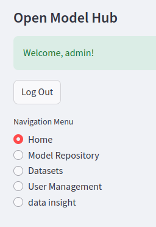

# Demonstration

## Run the program

### 1. backend: import data

- Show how we can initialize the database by importing the json file

- `demo.json` is the previous `db_with_pswd.json`

```shell
python database/load_data.py
```

### 2. frontend: run program

```shell
streamlit run frontend/app.py
```

1. user types
   1. common user login
   2. common user register and login
   3. admin login: has some pages that common users don't have

|sidebar|user|admin|
|-------|----|-----|


2. page types
    1. Home
    2. Model Repository
    3. Datasets
    4. User Management
    5. data insight
      - (presenter: Linyong Gan)


# todo list

## urgent

- [x] translate all code
- [ ] "LLM refined schema"
- [ ] powerpoint
- [ ] code demo

## not urgent

- [ ] report + each persons' part

