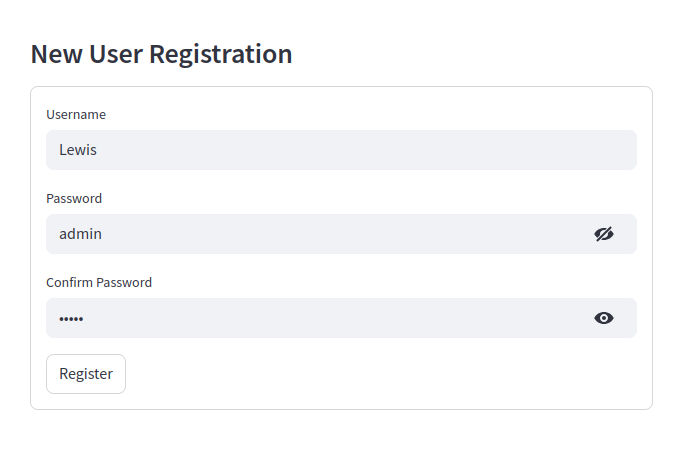
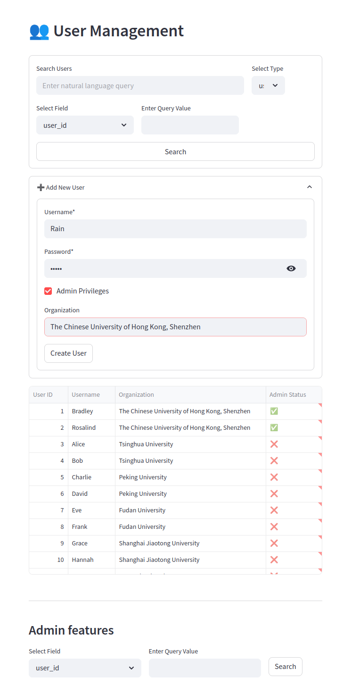
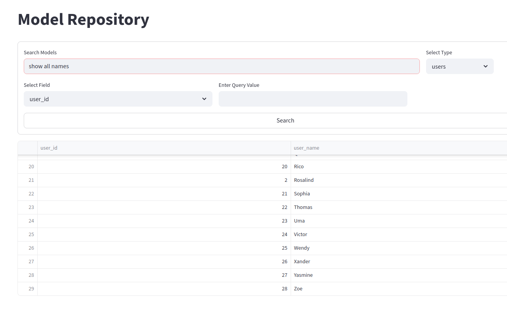

# Demonstration

## Run the program

### 1. backend: import data

- Show how we can initialize the database by importing the json file

- `demo.json` is the previous `db_with_pswd.json`

```shell
python database/load_data.py
```

### 2. frontend: run program

```shell
streamlit run frontend/app.py
```

1. user types
   1. common user login
   2. common user register and login
      
   3. admin login: has some pages that common users don't have

   | type    | user                                    | admin                                     |
   |---------|-----------------------------------------|-------------------------------------------|
   | sidebar |  |  | 

2. page types
    1. Home
       - export and download data
       -  
    2. Model Repository
       - search with/without specifying the instance
       - 
       - [LLM assisted search](#llm-assisted-search)
       - upload model
       - 
       - view details; paging; **view details: show 2 tables**
       - 

   3. Datasets
   4. **(Admin Privilege)** User Management

      - create user 
      - [edit user](material/page_userMng.pdf)

   5. **(Admin Privilege)** Data Insights

      - (presenter: Linyong Gan)
      - 
      - 

#### LLM assisted search

1. search according to architecture: transfomer models

    - result in the table: ...
        
    - sql query is also available:
        

2. compare classified and not classified

    |instance type|model|dataset|user|
    |----------|------|-------|-----|
    |query: show all names|||

3. more complicated search: ranking

    - query: top 10 users with the most published datasets    
    

# todo list

## urgent

- [x] translate all code
- [ ] "LLM refined schema"
- [ ] powerpoint
- [ ] code demo

## not urgent

- [ ] report + each persons' part
- [ ] report zip, pdf

