# CSC3170 Project: Database for Models and Datasets (Draft)

- Notation: different parts to complete.

  - [s] secure
  - [d] database schema
  - [f] frontend
  - [i] data insight
  - [?] other todo list

## 1. Introduction and motivation

### 1.1. Introduction

- Our project is a database for machine learning models and datasets.

  - **Basic database operations:** It allows users to browse the information about the models and datasets, upload and download models and datasets.

  - **Schema:** Apart from the basic schemas such as dataset, model, user, we also included schemas that are especially helpful for machine learning developers, such as tables describing the modular structures of different architecture of models (CNN, RNN, Transformer).

  - **GUI:** A beautifully designed graphic user interface is implemented, where users and administrators can perform multiple types of operations.

  - **LLM:** An LLM agent is implemented, to translate user's natural language query into SQL language. User can also customize their query by selecting different tables and different fields.

  - **Security:** Methods are implemented to protect data security.

### 1.2. Motivation

- We are motivated by [huggingface](https://huggingface.co/), one of the most influential platform in the AI community that facilitates the sharing and collaboration of machine learning models and datasets.

### 1.3 Analysis of the requirements of the organization
- Data Storage: The system must store models and datasets along with their metadata in a structured database.
- User Interface: A graphical interface should allow users and administrators to upload, download, and manage resources.
- AI-Assisted Querying: An AI agent should help users perform efficient and intelligent queries.
- Security and Privacy: Encryption and access control mechanisms must ensure data confidentiality and security.

### 1.4. How to run our code

- **Step 1-3 has to be done ONLY when running it at the first time; if it's not the first time, you can skip 1-3, and also can skip 4 if you don't need to initialize the database.**

1. Install dependencies according to `requirements.txt`
2. Create an `.env` file at the root directory of the project, and add the following lines to it (repalce `$your_api_key` and `$your_base_url` with your own values):

   ```bash
   # -----database-----
    DB_USERNAME=root
    DB_PASSWORD=123
    DB_HOST=0.0.0.0
    DB_PORT=3306
    TARGET_DB=openmodelhub
   # -----agent----
   API_KEY=$your_api_key
   BASE_URL=$your_base_url
   ```

3. Test connection by running `database/db_connection_check.py`.

4. Initialize the database with the records stored in `database/records/demo.json`, by running:

```shell
database/load_data.py
```

- then you'll be asked to choose a .json file stored in `database/records` to intialize it; just choose `demo.json`.

5. Run the GUI:

```shell
streamlit run frontend/app.py
```

6. Login as common user or admin

- Login to admin with **username: admin, password: admin**.
- After logging in as admin, you can see the list of all users in the page `user management`. Note that some users are admin, too, as indicated on the page.
- Every user's password is admin.
- You can register your own user, too.

## 2. Design and implementation

### 2.0. Project Structure

- our project is composed of the following components:
  1. Database.
  2. Data.
  3. Frontend.
  4. Agent.
  5. Security.
  6. Data analysis.

### 2.1. Database

#### E-R Diagram
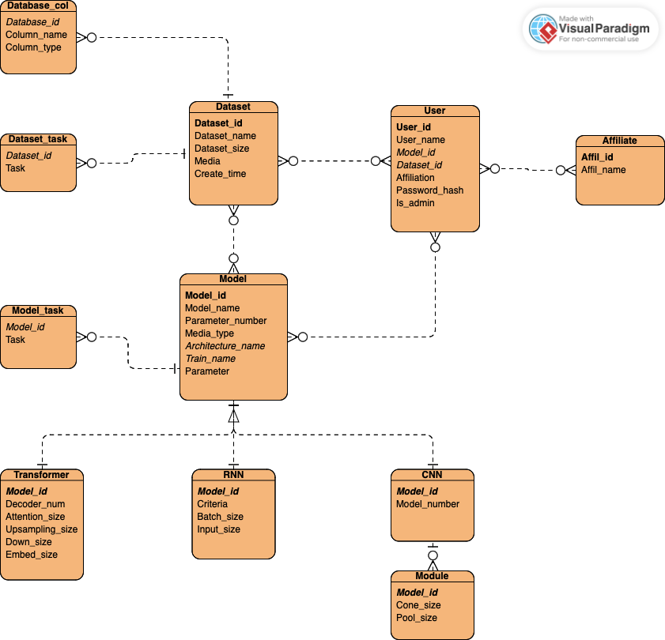

#### Schema Design

- Our database follows the relational model and the 4th normal form.
- Our schema are as follows:

#### **Model(model_id PK, model_name, param_num, media_type FK, arch_name FK, train_name FK, param)**
| **Attribute**       | **Description**                                                                                                       | **Data Type**    | **Example**  |
|---------------------|-----------------------------------------------------------------------------------------------------------------------|------------------|--------------|
| **model_id (PK)**   | A unique identifier for the model (Primary Key).                                                                       | int              | 1001         |
| **model_name**      | Name of the model.                                                                                                     | varchar          | gpt_4_13b    |
| **param_num**       | The number of parameters in the model.                                                                                  | bigint unsigned | 175000000000 |
| **media_type**      | Foreign Key that links to a table that defines the type of media the model deals with.                                  | enum            | text         |
| **arch_name (FK)**  | Foreign Key linking to the architecture name.                                                                          | enum             | transformer  |
| **train_name (FK)** | Foreign Key linking to the training process or dataset used for training.                                              | varchar          | pretrained   |
| **param**           |   binary parameter of the model|                                                                                       |blob             |x...         |  

#### **ModelTask(model_id FK, task_name)**
| **Attribute**       | **Description**                                                                                                       | **Data Type**    | **Example**  |
|---------------------|-----------------------------------------------------------------------------------------------------------------------|------------------|--------------|
| **model_id (PK,FK)**    | Foreign Key referencing **model_id** in the model table.                                                                | int              | 1001         |
| **task_name(PK)**        | The task associated with the model (e.g., classification, translation).                                                 | enum       | classification |

#### **Transformer(model_id PK, decoder_num, attn_size, up_size, down_size, embed_size)**
| **Attribute**       | **Description**                                                                                                       | **Data Type**    | **Example**  |
|---------------------|-----------------------------------------------------------------------------------------------------------------------|------------------|--------------|
| **model_id (PK, FK)**| Primary Key, Foreign Key referencing **model_id** in the model table.                                                   | int              | 1001         |
| **decoder_num**      | Number of decoders used in the model.                                                                                   | int              | 12           |
| **attn_size**        | Size of the attention mechanism used in the model.                                                                    | int              | 64           |
| **up_size**          | The upsampling size in the model.                                                                                      | int              | 256          |
| **down_size**        | The downsampling size in the model.                                                                                    | int              | 64           |
| **embed_size**       | The size of the embedding layer in the model.                                                                          | int              | 128          |

#### **CNN(model_id PK, module_num)**
| **Attribute**       | **Description**                                                                                                       | **Data Type**    | **Example**  |
|---------------------|-----------------------------------------------------------------------------------------------------------------------|------------------|--------------|
| **model_id (PK, FK)**| Primary Key, Foreign Key referencing **model_id** in the model table.                                                   | int              | 1001         |
| **module_num**       | The number of modules (e.g., convolution layers) in the model.                                                         | int              | 3            |

#### **Module(model_id FK, conv_size, pool_type)**
| **Attribute**       | **Description**                                                                                                       | **Data Type**    | **Example**  |
|---------------------|-----------------------------------------------------------------------------------------------------------------------|------------------|--------------|
| **id (PK)**          | auto increasement primary key                                                                                         | int              | 1            |
| **model_id (FK)**    | Foreign Key referencing **model_id** in the cnn table.                                                                | int              | 1001         |
| **conv_size**        | The size of the convolution layers in the model.                                                                      | int              | 3            |
| **pool_type**        | The type of pooling used in the model (e.g., max pooling, average pooling).                                            | enum       | max          |

#### **RNN(model_id PK, criteria, batch_size, input_size)**
| **Attribute**       | **Description**                                                                                                       | **Data Type**    | **Example**  |
|---------------------|-----------------------------------------------------------------------------------------------------------------------|------------------|--------------|
| **model_id (PK, FK)**| Primary Key, Foreign Key referencing **model_id** in the model table.                                                   | int              | 1001         |
| **criteria**         | The training criteria or loss function used by the RNN model.                                                           | varchar          | cross_entropy|
| **batch_size**       | The number of data samples processed together in one pass through the model (used in training).                         | int              | 64           |
| **input_size**       | The size of the input data (e.g., number of features for each data point).                                              | int              | 256          |

#### **Dataset(ds_id PK, ds_name, ds_size, media, created_at)**
| **Attribute**       | **Description**                                                                                                       | **Data Type**    | **Example**  |
|---------------------|-----------------------------------------------------------------------------------------------------------------------|------------------|--------------|
| **ds_id (PK)**       | Unique identifier for the dataset.                                                                                     | int              | 1            |
| **ds_name**          | The name of the dataset (e.g., "Coco", "ImageNet").                                                                    | varchar          | Coco         |
| **ds_size**          | The size of the dataset (e.g., number of images or data points).                                                       | int              | 1000000      |
| **media**            | The type of media in the dataset (e.g., image, text, video).                                                           | enum              | image        |
| **created_at**       | The date and time when the dataset was created.                                                                         | datetime         | 2025-04-01   |
| **description**       |The description of the dataset                                                                                         | varchar           | This dataset...|

#### **Dataset_TASK(ds_id FK, task)**
| **Attribute**       | **Description**                                                                                                       | **Data Type**    | **Example**  |
|---------------------|-----------------------------------------------------------------------------------------------------------------------|------------------|--------------|
| **ds_id (PK,FK)**       | Foreign Key referencing **ds_id** in the dataset table.                                                               | int              | 1            |
| **task (PK)**             | The task associated with the dataset (e.g., classification, segmentation).                                             | enum           | 1            |

#### **DsCol(ds_id PK, col_name, col_datatype)**
| **Attribute**       | **Description**                                                                                                       | **Data Type**    | **Example**  |
|---------------------|-----------------------------------------------------------------------------------------------------------------------|------------------|--------------|
| **ds_id (PK,FK)**       | Foreign Key referencing **ds_id** in the dataset table.                                                               | int              | 1            |
| **col_name (PK)**         | Name of the column within the dataset (e.g., "image_id", "label").                                                      | varchar          | image_id     |
| **col_datatype (PK)**     | The data type of the column (e.g., integer, float, text).                                                              | varchar          | integer      |

#### **user(user_id PK, user_name, model_id FK, ds_id FK, affiliate, password_hash, is_admin)**
| **Attribute**       | **Description**                                                                                                       | **Data Type**    | **Example**  |
|---------------------|-----------------------------------------------------------------------------------------------------------------------|------------------|--------------|
| **user_id (PK,FK)**  | Unique identifier for the user.                                                                                         | int              | 123090342    |
| **user_name**        | The name of the user (e.g., "JohnDoe").                                                                                  | varchar          | JohnDoe      |
| **affiliate**        | A reference to the affiliate company or group the user is associated with.                                             | varchar          | AffiliateX   |
| **password_hash**     || The hashed password of the user.                                                                                         | varchar          | $2b$12$...   |
| **is_admin**          | | Boolean flag indicating if the user has admin privileges.                                                             | boolean          | true         |   

#### **Affil(affil_id PK, affil_name)**
| **Attribute**       | **Description**                                                                                                       | **Data Type**    | **Example**  |
|---------------------|-----------------------------------------------------------------------------------------------------------------------|------------------|--------------|
| **affil_id (PK,FK)**    | Unique identifier for the affiliate.                                                                                   | int              | 1            |
| **affil_name**       | Name of the affiliate organization.                                                                                     | varchar          | AffiliateX   |

#### **UserAffil(user_id FK, affil_id FK)**
| **Attribute**       | **Description**                                                                                                       | **Data Type**    | **Example**  |
|---------------------|-----------------------------------------------------------------------------------------------------------------------|------------------|--------------|
| **user_id (PK,FK)**     | Foreign key referencing `user_id` in the **user** table                                                                | int              | 123090342    |
| **affil_id (PK,FK)**    | Foreign Key referencing `affil_id` in the **affli** table.                                                               | int              | 1            |

#### **UserDataset(user_id FK, ds_id FK)**
| **Attribute**   | **Description**                                                                  | **Data Type**   | **Example** |
|-----------------|----------------------------------------------------------------------------------|-----------------|-------------|
| **user_id (PK,FK)** | Foreign key referencing `user_id` in the **user** table                       | int             | 123090342   |
| **ds_id (PK,FK)**   | Foreign key referencing `ds_id` in the **dataset** table                      | 1           |

#### **ModelAuthor(model_id FK, user_id FK)**
| **Attribute**   | **Description**                                                                  | **Data Type**   | **Example** |
|-----------------|----------------------------------------------------------------------------------|-----------------|-------------|
| **model_id (PK,FK)**| Foreign key referencing `model_id` in the **model** table                | int             | 1001        |
| **user_id (PK,FK)** | Foreign key referencing `user_id` in the **user** table                  | int             | 123090342   |

#### **ModelDataset(model_id FK, ds_id FK)**

| **Attribute**        | **Description**                                           | **Data Type** | **Example** |
| -------------------- | --------------------------------------------------------- | ------------- | ----------- |
| **model_id (PK,FK)** | Foreign key referencing `model_id` in the **model** table | int           | 1001        |
| **ds_id (PK,FK)**    | Foreign key referencing `ds_id` in the **dataset** table  | int           | 1           |

---

- [?] llm optimized design

#### Implmentation

- In `database/database_schema.py`, schemas are represented by python classes.
- In `database/database_interface.py`, we have encapsulated interfaces to perform SQL operations safely. Therefore, in other programs where we have to execute SQL, we can call an encapsulated functions instead of executing the SQL operations directly.

### 2.2. Data

#### Data Fetching

Initially, all the data for the models and datasets are obtained from HuggingFace.co. Other data, such as users and relations, are generated randomly. Therefore, we did not look at all the information related to users and relations.

#### Initialization

- We created a set of records to initialize our database; although more records can be inserted to or deleted from the database during use. It is stored in `database/records/demo.json`, and can be run by `database/load_data.py`, [as indicated previously](#how-to-run-our-code).

- The records consist of:

  1. 12 affiliations;
  2. 28 users from these affiliations;
  3. 100 datasets;
  4. 92 models.

- The models' names, corresponding architecture, media type, train method (fine-tuned or pre-trained) are real; the dataset's names and media types are real, because they are copied from models and datasets that are actually posted to [huggingface](https://huggingface.co/). However, some other attributes, such as parameter number and authors, are made up.

#### Upload and Download

- `database/load_data.py` can initialize the database by inserting records stored in json formats, containing entities among `affiliation`, `user`, `dataset`, `model`.

- For model upload:

  - Users can upload models through the "Upload New Model" form in the Model Repository page
  - Required fields include: model name, architecture type (CNN/RNN/TRANSFORMER), media type (TEXT/IMAGE/AUDIO/VIDEO), training type (PRETRAIN/FINETUNE/RL), and task types
  - Supported file formats: .pt, .pth, .ckpt, .bin, .txt
  - Files are saved in `database/data/models` directory with timestamped filenames
  - Users can specify accessible users for the model

- For dataset upload:

  - Users can upload datasets through the "Upload New Dataset" form in the Dataset Management page
  - Required fields include: dataset name, media type, and task type
  - Supported file formats: .csv, .txt, .zip
  - Files are saved in `database/data/datasets` directory with timestamped filenames
  - Users can specify accessible users for the dataset

- For downloading:

  - Models and datasets can be downloaded from their respective detail pages
  - The system will automatically find the latest version of the file based on the filename
  - Files are served with appropriate MIME types for different file formats
  - The download functionality is implemented using Streamlit's download_button component

- File operations are handled by:
  - `frontend/file_operations.py`: Core file handling functions
  - `frontend/database_api.py`: Database interface for file operations
  - `frontend/components.py`: UI components for upload forms
  - `frontend/config.py`: Configuration for file paths and upload settings

### 2.3. Frontend

#### login/regsiter

1. common user login
2. common user register and login
3. admin login: has some pages that common users don't have.
   - username: admin; password: admin.

- The pages visible to a common user / an admin is different.

  | type    | user                                    | admin                                     |
  | ------- | --------------------------------------- | ----------------------------------------- |
  | sidebar | 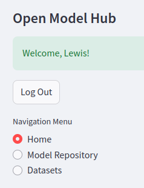 |  |

#### Home page

- export and download data.

#### Model/Dataset Repository page

- the following screenshots are from the model page; but the dataset page is very similar.

| **[LLM assisted search, with specifying the entity in the drop-down box](#4-agent)** | upload model                         | click "view details", and 2 tables representing the detailed information of that model will be displayed. paging are implemented for improved user experiment. |
| ------------------------------------------------------------------------------------ | ------------------------------------ | -------------------------------------------------------------------------------------------------------------------------------------------------------------- |
| 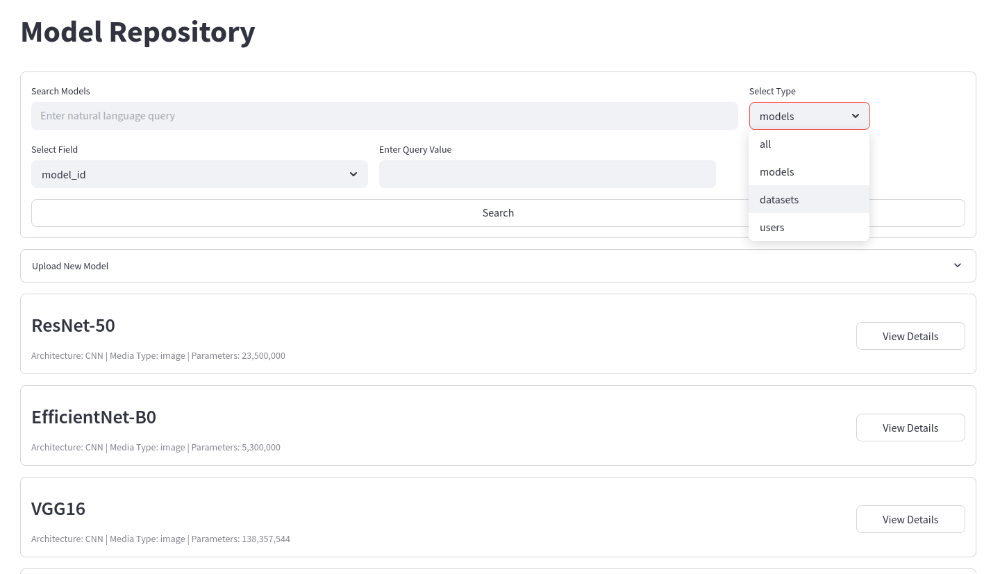                                                  | 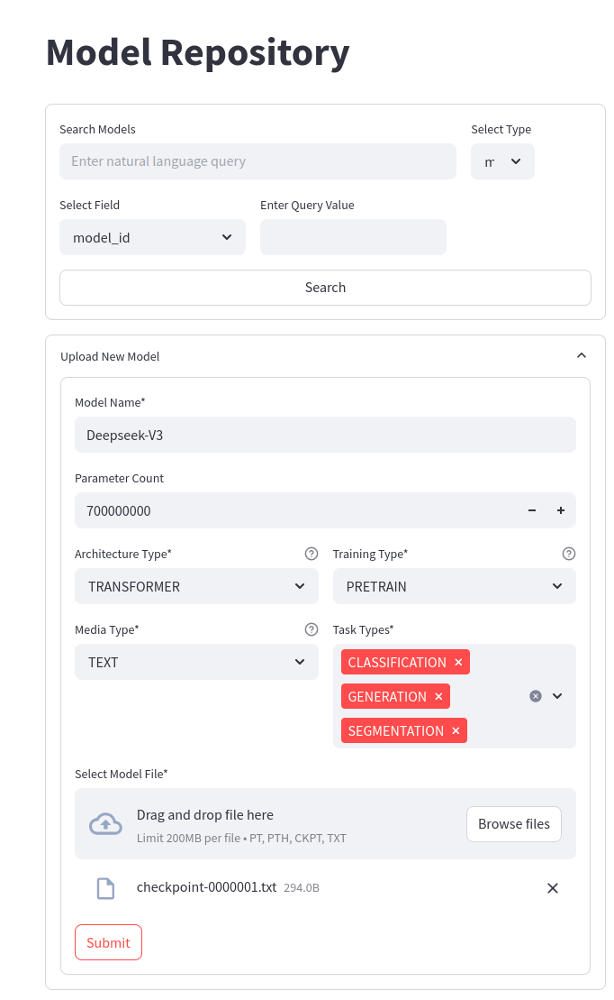 | 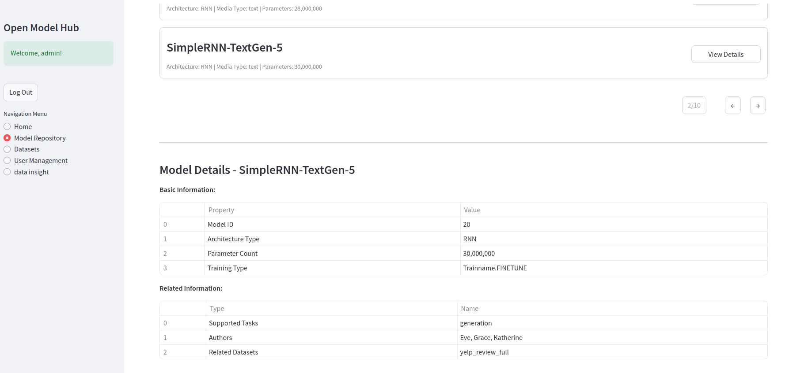                                                                                                                     |

#### **(Admin Privilege)** User Management / Data Insight

| 4. **(Admin Privilege)** User Management                 | 5. **(Admin Privilege)** [Data Insights](#6-data-insight)                                 | data insight, page 2                               |
| -------------------------------------------------------- | ----------------------------------------------------------------------------------------- | -------------------------------------------------- |
| create/edit user 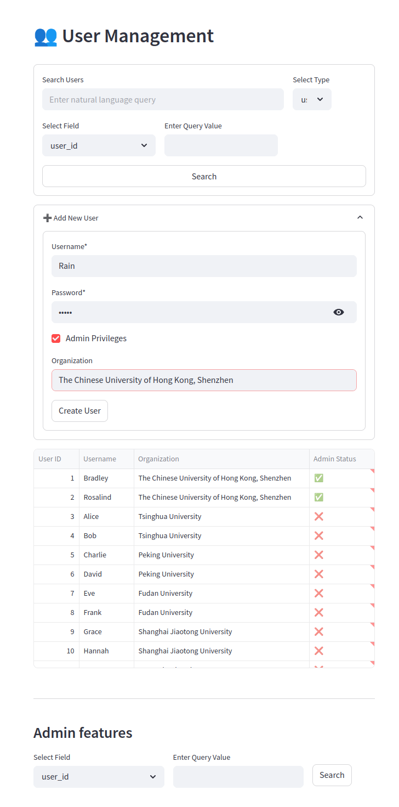 | illustration of the analysis on the data in the database. 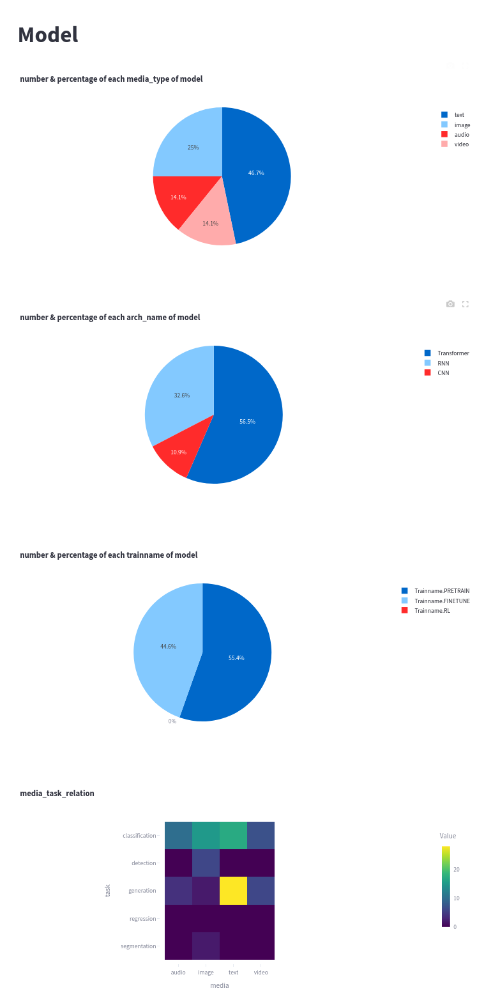 | Also illustration. 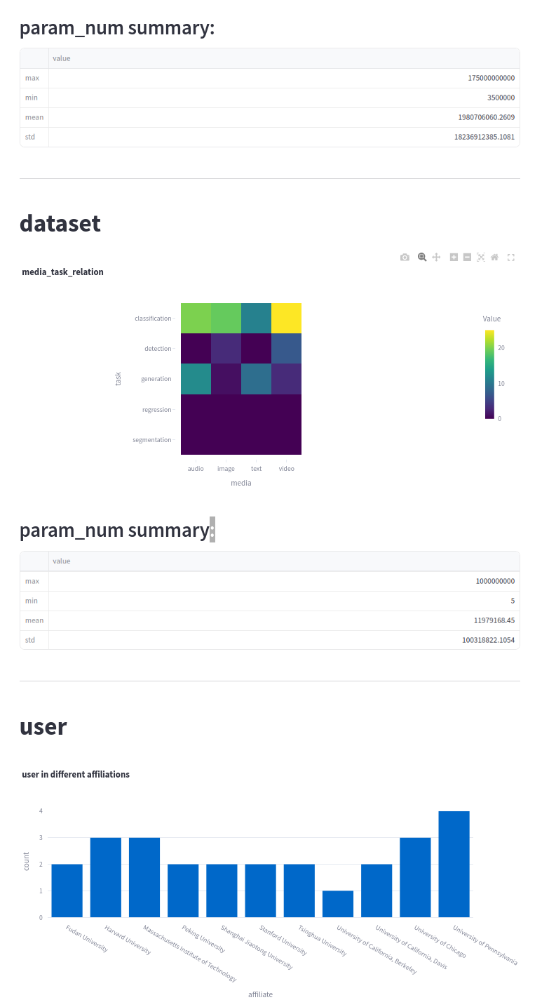 |

### 2.4. Agent

#### Implementation

- We incorporated gpt-4o as an LLM agent that translates user's natural language input into SQL queries.

- **Input/Output**

  - Input includes a natural language query, and a integer specifying the type of entity user is asking for. A corresponding string will be appended to the natural language query. This integer is by default 0, indicating no specific constraints.
  - Output: a dictionary, consisting of:
    - an error code indicating whether a grammatically correct sql is generated;
    - a SQL query generated
    - the result of the SQL query

- **System prompt**

  - **Schema:** In the system prompt, we describe our database, the integrity constraints, and other information required.
  - **Synonyms:** In practice, we find it necessary to add some synonyms to help agent understand user's needs in this context. For example, if user asks for a `langauge model`, user is referring to `models where media_type includes 'text'`
  - **Instance type:** The constraints on the type of entity user's asking for is also indicated in the system prompt.

- **2-stage error-detection leveraging agent's self-correction**:

  - After the SQL is created, it will be executed to check its grammatical correctness, instead of directly returning the SQL.
  - **If incorrect, agent will perform another attempt to generate SQL, based on the previous failure.** However, if it fails again, no more attempts will be made.

#### Demonstration: using LLM assisted search in the GUI

- Feature: generate query of a specific entity.

  | entity type           | model                                | dataset                                   | user                                     |
  | --------------------- | ------------------------------------ | ----------------------------------------- | ---------------------------------------- |
  | query: show all names |  | 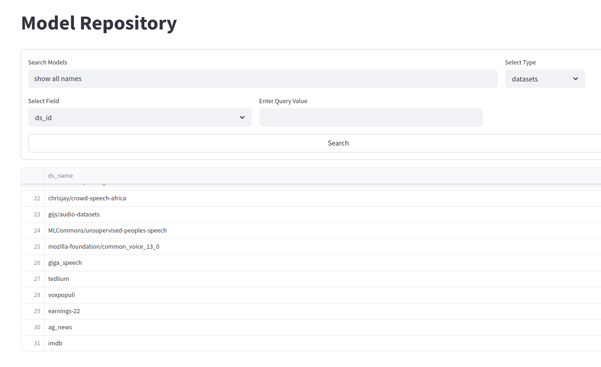 | 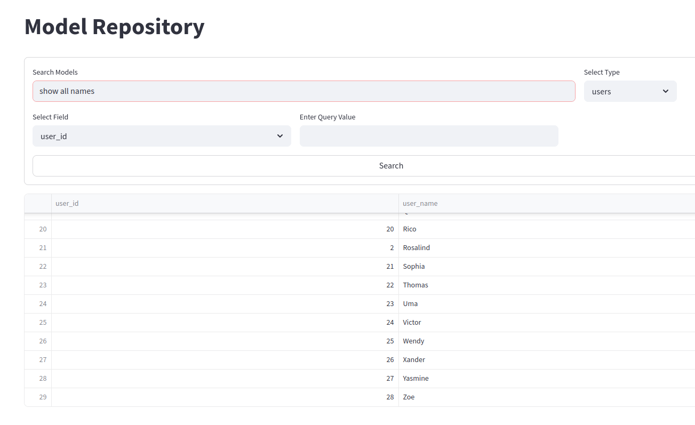 |

- other queries

  | Query  | Find all transformer models                                              | (same as previous)                                                                       | top 10 users with the most published datasets                                       |
  | ------ | ------------------------------------------------------------------------ | ---------------------------------------------------------------------------------------- | ----------------------------------------------------------------------------------- |
  | Result | Result can be represented in a table. 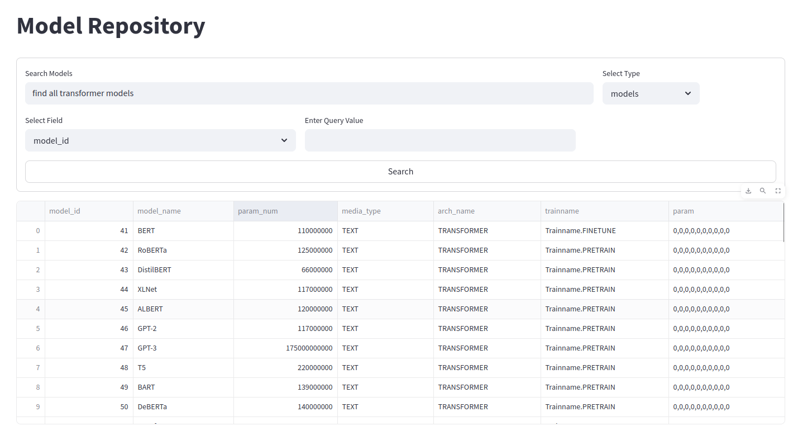 | Can also view the corresponding SQL query. 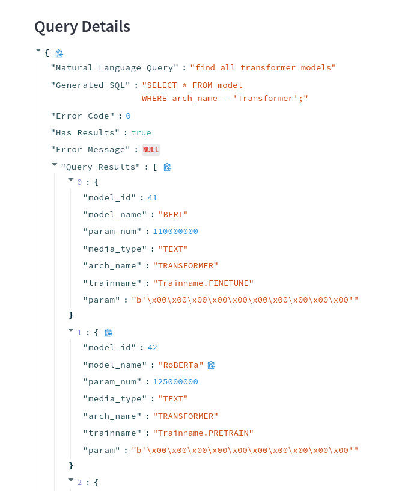 | More complicated queries can also be executed. 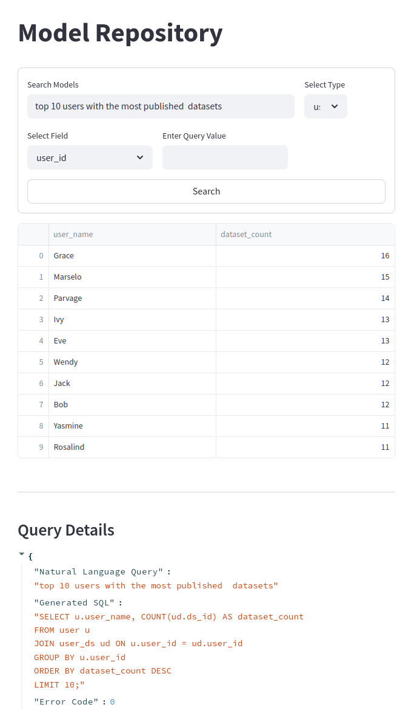 |

### 2.5. Security

#### Hybrid Encryption

Utilizes a combination of symmetric (AES-CBC) and asymmetric (RSA) encryption to protect sensitive data such as user credentials and model/dataset metadata. Files and database entries are encrypted at rest.

#### Authentication & Integrity

Implements Argon2Key for secure password derivation and HMAC and RSA for data integrity verification. User sessions are validated via challenge-response mechanisms.

#### Access Control

Role-based access (user/admin) with granular permissions.

#### Secure Data Sharing

Users can share models/datasets via encrypted invitations, revocable by owners.

#### Audit Trails

All user actions (uploads, downloads, modifications) are logged with timestamps and hashed to prevent tampering.

#### Realization

- User passwords are hashed with Argon2Key and stored.
- Database fields containing sensitive data (e.g., model parameters) are encrypted using symmetric encryption.
- The frontend integrates with the security module to enforce role-based UI rendering and API access.
- Security schema designed to guarantee data security, retrievability, and timely revocation. 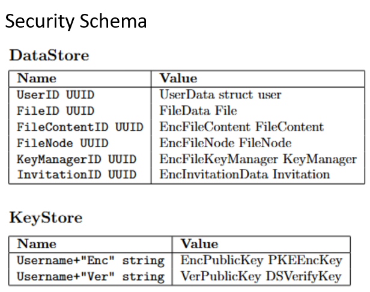

This section aligns with the project's focus on usability while ensuring compliance with confidentiality, integrity, and availability principles.

### 2.6. Data Insight

We dynamically analyze the database when the user renders to the `Data Insight` page. The database will be analyzed in three aspects: models, datasets, and users stored in the database.

For the model part, we summarize the percentage of different media types, architecture names, and training types. We also investigate the relation between media types and tasks using the heat map. Moreover, we summarized the parameter numbers by their maximum, minimum, mean, and standard deviation.

For the dataset part, we summarize the relation between media types and tasks using a heat map. Also, we summarized the parameter numbers by their maximum, minimum, mean, and standard deviation.

For the user part, we count the total number of users for each affiliation.

### 2.7. Sample SQL Queries

#### SQL Queries used for practical daily operations and activities

```sql
CREATE TABLE affiliate (
    affil_id INT AUTO_INCREMENT PRIMARY KEY,
    affil_name VARCHAR(50)
);

INSERT INTO user (user_id, user_name, Affiliation, password_hash, is_admin) 
VALUES (0, 'Alice', 'The Chinese University of Hong Kong, Shenzhen', 'ILoveCSC3170', FALSE);

UPDATE model 
SET Media_type = 'audio' 
WHERE Media_type = 'Music';
```

#### SQL Queries used for data analysis

```sql
SELECT
    Train_name,
    COUNT(*) AS TOT_TRAIN_NAME
FROM
    model
GROUP BY
    Train_name
HAVING
    COUNT(*) > 15;
```

## 3. Conclusion and self-evaluation

### 3.1. Conclusion

- We has completed task [?] indicated in the project guideline.
- [?] mention detailed implementation here.

### 3.2. Self-Evaluation

- Work division is as follows: (members' names follows alphabetical order)

#### Linyong Gan

- Implemented the entire `Data Insights` part.
- Generated the demo data for the database obtained from HuggingFace.
- Fix some type constraints of attributes.
- Drafted the answers to seven questions of this project and designed the powerpoint slides of presentation. 

#### Yimeng Teng

- Implemented the entire `agent` part. Generated test cases to evaluate and refine it.
- Collaborated with Linyong Gan to generate `demo.json`, which contains sufficient amounts of records for initializing the database.
- Collaborated with Wentao Lin in implementing a data loader that load json files and insert records to the database. Designed the first version and help completed the final version.
- Participated in the formulation of the database schema (but not the implementation).

#### Yufeng Lin

- Collaborated with all members in designing database schema.
- Implement the entire database schema part.
- Implement the entire database interface part.
- Collaborated with Wentao Lin, Zirun Zheng, and Yuxuan Liu in fixing bugs in frontend.
- Manage the github repository and handle pull requests.
- Manage the project, communicate with members and assign taks.
- Group leader

#### Yuxuan Liu
- Collaborated with Wentao Lin, Zirun Zheng, and Yufeng Lin in refining the `frontend` part.
- Participated in the design of database schema and draw the E-R diagram.
- Inplemented the associate search and attribute search functionality in the frontend.

#### Zirun Zheng
- Collaborated with Wentao Lin, Yuxuan Liu, and Yufeng Lin in refining the `frontend` part.
- Integrate with the agent and datebase part to implement the frontend's search functionality and pagination functionality, and further refine with Wentao Lin.
- Collaborated with Wentao Lin in implementing the data upload and download functionality.
- Translate the frontend's texts into English.

#### Wentao Lin

- Designed and implemented the core frontend architecture using Streamlit framework.
- Developed the database API middleware layer for secure and efficient data operations.
- Created modular components for user authentication, file upload/download, and search functionality.
- Implemented the pagination system with Zirun Zheng and data visualization components.
- Integrated the LLM agent with the frontend search interface with YuXuan Liu.
- Collaborated with Zirun Zheng in refining the user interface and implementing file operations.

#### Shuhan Zhang
- Designed the security schema upon database schema.
- Designed the security code architecture.
- Implemented symmetric and asymmetric encryption and signature algorithms.
- Implemented user, invitation, and key operation functions.
- Implemented python-Go socket connector.
- Implemented encryption and decryption logics in frontend.

## 4. References

- https://huggingface.co/
- Biryukov, A., Dinu, D., & Khovratovich, D. (2016, March). Argon2: new generation of memory-hard functions for password hashing and other applications. In 2016 IEEE European Symposium on Security and Privacy (EuroS&P) (pp. 292-302). IEEE.
- Feistel, H. (1973). Cryptography and computer privacy. Scientific american, 228(5), 15-23.
- Krawczyk, H., Bellare, M., & Canetti, R. (1997). HMAC: Keyed-hashing for message authentication (No. rfc2104).
- Rivest, R. L., Shamir, A., & Adleman, L. (1978). A method for obtaining digital signatures and public-key cryptosystems. Communications of the ACM, 21(2), 120-126.

## 5. Appendices

[?] what to include

[THE WHOLE PART needs fact-checking!! whether my description is accurate?]:
````
