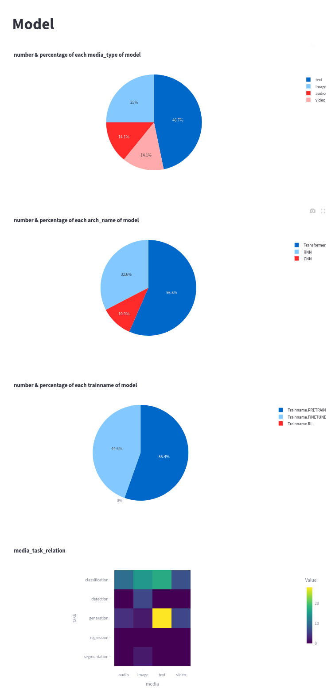

# CSC3170 Project: Database for Models and Datasets (Draft)

- Notation: different parts to complete.

  - [s] secure
  - [d] database schema
  - [f] frontend
  - [i] data insight
  - [?] other todo list

## 1. Introduction and motivation

### 1.1. Introduction

- Our project is a database for machine learning models and datasets.

  - **Basic database operations:** It allows users to browse the information about the models and datasets, upload and download models and datasets.

  - **Schema:** A variety of schemas is implemented. Apart from the basic schemas such as dataset, model, user, we also included schemas that are especially helpful for machine learning developers, such as the layer structure of different architecture of models (CNN, RNN, Transformer).

  - **GUI:** A beautifully designed graphic user interface is implemented, where users and administrators can perform multiple types of operations.

  - **LLM:** An LLM agent is implemented, to translate user's natural language query into SQL language. User can also customize their query by selecting different tables and different fields.

  - **Security:** Methods are implemented to protect data security,

### 1.2. Motivation

- We are motivated by [huggingface](https://huggingface.co/), one of the most influential platform in the AI community that facilitates the sharing and collaboration of machine learning models and datasets. As the number of machine learning models and datasets continues to grow rapidly, there is a pressing need for a structured and efficient way to manage these resources.

- When using a machine learning database with a considerable amount of data, it may be challenging for users to find a model or dataset that suits their requirement by traditional seache methods, or by directly inputting SQL, which may be technically challenging for general users.

- Therefore, we implement an agent to assists the user's queries, enhancing flexibility for users to perform customized operations, as well as efficiency especially when the user's need is too complicated to be manually written into SQL.

- Furthermore, the increasing concern over data security and privacy necessitates more robust solutions to protect valuable information. [s]

### 1.3. How to run our code

- **Step 1-3 has to be done ONLY when running it at the first time; if it's not the first time, you can skip 1-3, and also can skip 4 if you don't need to initialize the database.**
- [q] _update this part after startup.py is finished._

1. Install dependencies according to `requirement.txt` [?]
2. Create an `.env` file at the root directory of the project, and add the following lines to it (repalce `$your_api_key` and `$your_base_url` with your own values):
   ```bash
   # -----database-----
    DB_USERNAME=root
    DB_PASSWORD=123
    DB_HOST=0.0.0.0
    DB_PORT=3306
    TARGET_DB=openmodelhub
   # -----agent----
   API_KEY=$your_api_key
   BASE_URL=$your_base_url
   ```
3. Test connection by running `database/db_connection_check.py`.
4. Initialize the database with the records stored in `database/records/demo.json`, by running:

```shell
database/load_data.py
```

- then you'll be asked to choose a .json file stored in `database/records` to intialize it; just choose `demo.json`.

5. Run the GUI:

```shell
streamlit run frontend/app.py
```

6. Login as common user or admin

- Login to admin with **username: admin, password: admin**.
- After logging in as admin, you can see the list of all users in the page `user management`. Note that some users are admin, too, as indicated on the page.
- Every user's password is admin.
- You can register your own user, too.

## 2. Design and implementation

### 2.0. Project Structure

- our project is composed of the following components:
  1. Database.
  2. Data.
  3. Frontend.
  4. Agent.
  5. Security.
  6. Data analysis.

### 2.1. Database

- [d][THE WHOLE PART needs fact-checking!! whether my description is accurate?]

#### Schema Design

- Our database follows the relational model and the 4th normal form.
- Our schema are as follows:

- [d] [please insert a markdown format table here to show the schema. can be generated from our slides.]

- [?] llm optimized design

#### Implmentation

- In `database/database_schema.py`, schemas are represented by python classes.
- In `database/database_interface.py`, we have encapsulated interfaces to perform SQL operations safely. Therefore, in other programs where we have to execute SQL, we can call an encapsulated functions instead of executing the SQL operations directly.

### 2.2. Data

#### Initialization

- We created a set of records to initialize our database; although more records can be inserted to or deleted from the database during use. It is stored in `database/records/demo.json`, and can be run by `database/load_data.py`, [as indicated previously](#how-to-run-our-code).

- The records consist of:

  1. 12 affiliations;
  2. 28 users from these affiliations;
  3. 100 datasets;
  4. 92 models.

- The models' names, corresponding architecture, media type, train method (fine-tuned or pre-trained) are real; the dataset's names and media types are real, because they are copied from models and datasets that are actually posted to [huggingface](https://huggingface.co/). However, some other attributes, such as parameter number and authors, are made up.

#### Upload and Download

- `database/load_data.py` can initialize the database by inserting records stored in json formats, containing entities among `affiliation`, `user`, `dataset`, `model`.

- For model upload:

  - Users can upload models through the "Upload New Model" form in the Model Repository page
  - Required fields include: model name, architecture type (CNN/RNN/TRANSFORMER), media type (TEXT/IMAGE/AUDIO/VIDEO), training type (PRETRAIN/FINETUNE/RL), and task types
  - Supported file formats: .pt, .pth, .ckpt, .bin, .txt
  - Files are saved in `database/data/models` directory with timestamped filenames
  - Users can specify accessible users for the model

- For dataset upload:

  - Users can upload datasets through the "Upload New Dataset" form in the Dataset Management page
  - Required fields include: dataset name, media type, and task type
  - Supported file formats: .csv, .txt, .zip
  - Files are saved in `database/data/datasets` directory with timestamped filenames
  - Users can specify accessible users for the dataset

- For downloading:

  - Models and datasets can be downloaded from their respective detail pages
  - The system will automatically find the latest version of the file based on the filename
  - Files are served with appropriate MIME types for different file formats
  - The download functionality is implemented using Streamlit's download_button component

- File operations are handled by:
  - `frontend/file_operations.py`: Core file handling functions
  - `frontend/database_api.py`: Database interface for file operations
  - `frontend/components.py`: UI components for upload forms
  - `frontend/config.py`: Configuration for file paths and upload settings

### 2.3. Frontend

1. user types

   1. common user login
   2. common user register and login
      
   3. admin login: has some pages that common users don't have.
      - username: admin; password: admin.

   | type    | user                                    | admin                                     |
   | ------- | --------------------------------------- | ----------------------------------------- |
   | sidebar |  |  |

   2. page types

      1. Home
         - export and download data
         - 
      2. Model Repository

         - search with/without specifying the instance in the drop-down box
         - 
         - **[LLM assisted search: refer to a following part](#4-agent)**
         - upload model
         - 
         - click "view details", and 2 tables representing the detailed information of that model will be displayed.
         - 
         - paging are implemented for improved user experiment.

      3. Datasets
      4. **(Admin Privilege)** User Management

         - create user 
         - [edit user](material/page_userMng.pdf)

      5. **(Admin Privilege)** [Data Insights](#6-data-insight)

         - illustration of the analysis on the data in the database.

      |                                 |                                 |
      | ------------------------------- | ------------------------------- |
      |  |  |

### 2.4. Agent

#### Implementation

- We incorporated gpt-4o as an LLM agent that translates user's natural language input into SQL queries.

  - in `agent/agent_main.py`:

    ```python
    async def natural_language_to_sql(nl_input: str) -> str:
        response = await client.chat.completions.create(
            model="gpt-4o",
            messages=[
                {"role": "system", "content": SYSTEM_PROMPT},
                {"role": "user", "content": nl_input}
            ],
            temperature=0,
        )
        return clean_sql_output(response.choices[0].message.content)
    ```

- **Input/Output**

  - Input includes a natural language query, and a integer specifying the type of instance user is asking for. A corresponding string will be appended to the natural language query. This integer is by default 0, indicating no specific constraints.
  - Output: a dictionary, consisting of:

    - an error code indicating whether a gramatically correct sql is generated;
    - a SQL query generated
    - the result of the SQL query

    - corresponding code from `agent/agent_main`:
      ```python
      async def query_agent(nl_input: str, verbose = False, session = None, instance_type = 0):
          ret_dic = {
              'err': 0,
              'sql': '',
              'sql_res': ''
          }
          ...
          return ret_dic
      ```

- **System prompt**

  - **Schema:** In the system prompt, we describe our database, the integrity constraints, and other information required.
  - **Synonyms:** In practice, we find it necessary to add some synonyms to help agent understand user's needs in this context. For example, if user asks for a `langauge model`, user is referring to `models where media_type includes 'text'`
  - **Instance type:** The constraints on the type of instance user's asking for is also indicated in the system prompt.

- **2-stage error-detection leveraging agent's self-correction**:

  - After the SQL is created, it will be executed to check its grammatical correctness, instead of directly returning the SQL.
  - **If incorrect, agent will perform another attempt to generate SQL, based on the previous failure.** However, if it fails again, no more attempts will be made.

  - corresponding code from `agent/agent_main.query_agent()`:

    ```python
      # execute sql, attempt 1
      result, error = await execute_sql(sql, session)
      ret_dic["sql_res"] = result

      if error:
          # generate sql, attempt 2
          print("\n⚠️ Execution error, attempting to fix...")
          fixed_sql = await fix_sql_with_error(nl_input, sql, error)
          ret_dic['sql'] = fixed_sql
          if verbose: print("\n🔁 Fixed SQL:", fixed_sql)

          # execute sql, attempt 2
          result, error = await execute_sql(fixed_sql, session)
          ret_dic["sql_res"] = result

          if error:
              # define as failed if fix failed as well.
              ret_dic['err'] = 1
              if verbose: print("\n❌ Fix failed:", error)
          else:
              ret_dic['sql'] = fixed_sql
              if verbose: print("\n✅ Fix succeeded, results are as follows:\n", result)
      else:
          if verbose: print("\n✅ Execution succeeded, results are as follows:\n", result)
    ```

#### Demonstration: using LLM assisted search in the GUI

1. search according to architecture: transfomer models

   - result in the table: ...
     
   - sql query is also available:
     

2. compare classified and not classified

   | instance type         | model                                | dataset                                   | user                                     |
   | --------------------- | ------------------------------------ | ----------------------------------------- | ---------------------------------------- |
   | query: show all names |  |  |  |

3. more complicated search: ranking

   - query: top 10 users with the most published datasets  
     

### 2.5. Security

- [s]

### 2.6. Data Insight

- [i]

## 3. Conclusion and self-evaluation

### 3.1. Conclusion

- We has completed task [?] indicated in the project guideline.
- [?] mention detailed implementation here.

### 3.2. Self-Evaluation

- Work division is as follows: (members' names follows alphabetical order)

#### Yimeng Teng

- Implemented the entire `agent` part. Generated test cases to evaluate and refine it.
- Collaborated with Linyong Gan to generate `demo.json`, which contains sufficient amounts of records for initializing the database.
- Collaborated with Wentao Lin in implementing a data loader that load json files and insert records to the database. Designed the first version and help completed the final version.
- Participated in the formulation of the database schema (but not the implementation).

## 4. References

- https://huggingface.co/
- Feistel, H. (1973). Cryptography and computer privacy. Scientific american, 228(5), 15-23.
- Rivest, R. L., Shamir, A., & Adleman, L. (1978). A method for obtaining digital signatures and public-key cryptosystems. Communications of the ACM, 21(2), 120-126.

## 5. Appendices
